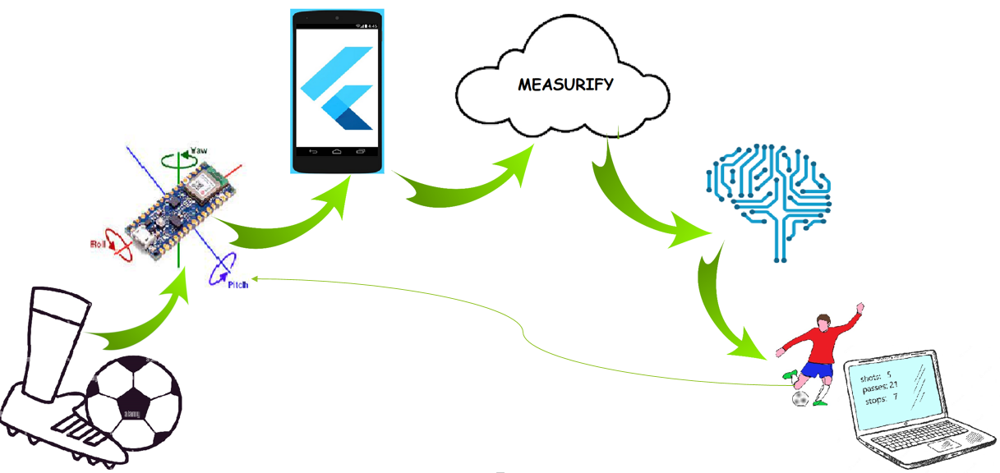
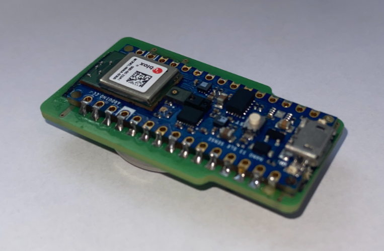

# Design and implementation of an embedded system for sports data collection

## Overview
This thesis project aims to develop a complete system for collecting and
data classification in the sport of football, specifically for autonomous recognition
of shooting, passing and stopping. An Arduino Nano BLE Sense mounted on a shin guard connects via
bluetooth to a mobile device application programmed with flutter. This application
receives data relating to the board's IMU and sends it in turn to a cloud via [Measurify](https://measurify.org/)
with the addition of tags that identify the type of movement being recorded. These
information constitutes the dataset needed to train a machine learning model. 
At the end of this training, the model is capable of autonomously recognizing the three movements
above mentioned.

## Hardware
The board used is a [Arduino Nano BLE Sense](https://docs.arduino.cc/hardware/nano-33-ble-sense)

## Software
The necessary code è:
1. Arduino script on [Arduino IDE](https://www.arduino.cc/en/software)
2. Flutter code on [VSCode](https://code.visualstudio.com/)
3. Machine learning model developed by the laboratory [Elios Lab](https://elios.diten.unige.it/)

## Quick start
Connect the Arduino via cable connection to the computer, selecting from the Arduino IDE menu
*Serial Port* your Arduino and the cable to which it is connected (it should appear among the possible choices as COM-).
Search and install (if they are not already) in the *Manage Libraries* section the libraries included in the first part of the script.
At this point, load the script with the button at the top right. Once the upload is finished, you can log out
the Arduino from the computer. Thanks to the custom battery mounted on it, it will be able to work without the need for cables.
Now switch to the flutter application: on VSCode load the flutter code and connect a mobile device via cable to
run the app on it.Warning: to make it work you will first have to activate developer mode on your
device settings and enable the "allow debugging" option. Once these precautions have been implemented, you can load the code by selecting
*run* and then *run without debugging* selecting your device from the banner that opens centrally above the code
among those available. Loading will take a few minutes. Once completed (you can disconnect the device from the computer),
The app interface will automatically appear in full screen with the page for scanning nearby Bluetooth devices.
Turn on the Arduino and *Measurify-Meter*, the ID of your board, will appear on the device screen. Select it
and the second screen for configuring the connection will open. Connect the Arduino to the device and you are ready to harvest
the data. In the movement collection screen, select the tags relating to the movement you want to record from the drop-down menus
and enter a label for the measurement name, then select the IMU option. Now press *start* and the Arduino will start
send the data to your device. When you are done with the collection, press *stop and send* and if the data has arrived correctly
to the cloud the message "data sent correctly" will appear at the bottom of the screen. once you have trained the model with the data 
sent to the cloud, you can proceed with testing it. To do this, reconnect the Arduino to the computer and load the trained model. 
Now record the testing hits the same way you recorded the hits for the dataset. The output of the Arduino will show you its predictions 
oof the movements. In this way you can discover how accurate the model is.
 
